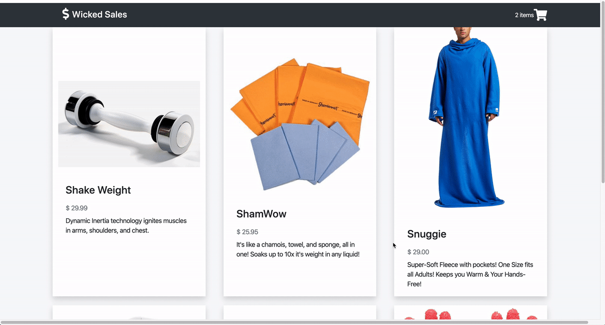

# wicked-sales.js
A Full-Stack Node.js and React Shopping Cart App.

## Technologies Used
- React.js
- Webpack 4
- Node.js
- PostgreSQL
- AWS EC2
- HTML5
- Bootstrap 4
- CSS3

## Live Demo

[Wicked Sales](https://wicked-sales.waynedaniels.net/ "Wicked Sales")

## Features

- Shopper can view catalog.
- Shopper can add items to their cart.
- Shopper can view cart.
- Shopper can view checkout.
- Shopper can input name/address/credit-card at checkout.

## Preview


## Development

#### System Requirements
- Node.js 10 or higher.
- NPM 6 or higher.

#### Getting Started

Clone this repository.
``` shell
git clone https://github.com/wayne-daniels/wicked-sales-js.git
cd wicked-sales-js
```

Install all dependencies with NPM.
```shell
npm install
```

Import the example database to postgres database.
```shell
npm run db:import
```

Start the project and view by opening http://localhost:3000 in your browser.
```shell
npm rub
```
